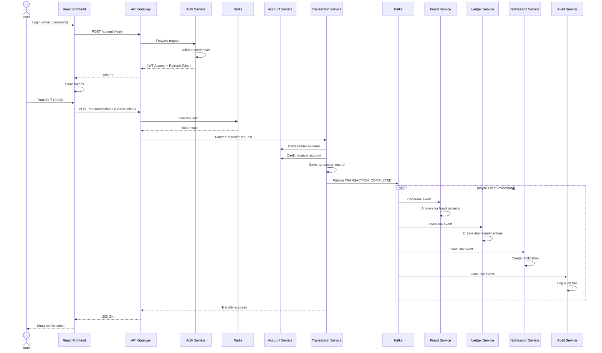
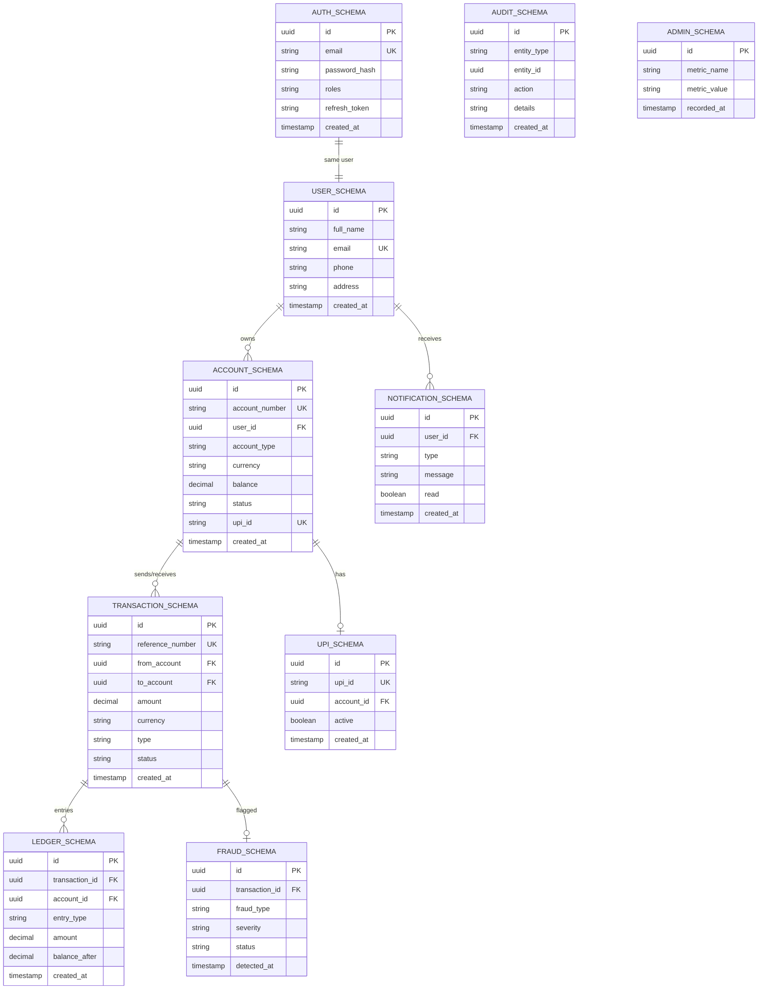

<p align="center">
  
  
  
  
  
  
</p>

<h1 align="center">🏦 NexBank — Digital Banking Platform</h1>

<p align="center">
  <strong>A production-grade, microservices-based digital banking system built with Spring Boot 3, React 19, and event-driven architecture.</strong>
</p>

---

## 📑 Table of Contents

- [Overview](#-overview)
- [Key Features](#-key-features)
- [Architecture](#-architecture)
  - [System Architecture Diagram](#system-architecture-diagram)
  - [Request Flow](#request-flow)
  - [Database Schema Layout](#database-schema-layout)
- [Tech Stack](#-tech-stack)
- [Microservices Breakdown](#-microservices-breakdown)
- [Getting Started](#-getting-started)
  - [Prerequisites](#prerequisites)
  - [Option 1 — Full Docker Deployment](#option-1--full-docker-deployment)
  - [Option 2 — Local Development](#option-2--local-development-recommended)
- [Service URLs & Ports](#-service-urls--ports)
- [API Reference](#-api-reference)
- [Environment Configuration](#-environment-configuration)
- [Database Access](#-database-access)
- [Frontend Features](#-frontend-features)
- [Project Structure](#-project-structure)
- [Troubleshooting](#-troubleshooting)
- [Contributing](#-contributing)
- [License](#-license)

---

## 🌟 Overview

**NexBank** is a fully functional digital banking platform designed with a microservices architecture. It simulates real-world banking operations including user management, multi-currency accounts, fund transfers (including UPI), real-time fraud detection, double-entry ledger bookkeeping, audit logging, and an admin monitoring dashboard — all orchestrated through an API gateway with JWT-based authentication.

The system is built to be **production-grade**, featuring service discovery, centralized configuration, distributed tracing, event-driven communication via Kafka, Redis caching, and circuit-breaker patterns for resilience.

---

## ✨ Key Features

| Category | Features |
|---|---|
| **Authentication** | JWT-based auth with access + refresh tokens, role-based access (USER / ADMIN), secure password hashing |
| **Account Management** | Multi-currency accounts (INR, USD, EUR, GBP, JPY, etc.), UPI ID generation, account balance tracking |
| **Transactions** | Fund transfers between accounts, cross-currency transfers with live exchange rates, complete transaction history |
| **UPI Payments** | UPI ID registration & linking, UPI-based fund transfers |
| **Currency Exchange** | Live exchange rates via ExchangeRate-API, Redis-cached rates, graceful fallback to static rates |
| **Fraud Detection** | Real-time Kafka-driven fraud analysis, configurable thresholds for large/cross-currency transactions |
| **Ledger** | Double-entry bookkeeping, debit/credit ledger entries for every transaction |
| **Notifications** | Kafka-consumed event notifications, in-app notification center |
| **Audit Trail** | Complete audit logging of all system events via Kafka |
| **Admin Dashboard** | System health monitoring, user/account/transaction overview, fraud alerts |
| **Frontend** | Modern React 19 SPA with dark/light mode, animated UI, responsive design |

---

## 🏗 Architecture

### System Architecture Diagram

```mermaid
graph TB
    subgraph Client
        FE["🖥️ React Frontend<br/>(Vite + TypeScript)"]
    end

    subgraph Gateway Layer
        GW["🔀 API Gateway<br/>:8080"]
    end

    subgraph Service Discovery
        EU["📡 Eureka Server<br/>:8761"]
        CS["⚙️ Config Server<br/>:8888"]
    end

    subgraph Core Services
        AS["🔐 Auth Service<br/>:8081"]
        US["👤 User Service<br/>:8082"]
        AC["🏦 Account Service<br/>:8083"]
        TS["💸 Transaction Service<br/>:8084"]
        LS["📒 Ledger Service<br/>:8085"]
        UP["📱 UPI Service<br/>:8086"]
        CU["💱 Currency Service<br/>:8087"]
    end

    subgraph Support Services
        FR["🛡️ Fraud Service<br/>:8088"]
        NS["🔔 Notification Service<br/>:8089"]
        AU["📋 Audit Service<br/>:8090"]
        AM["📊 Admin Monitoring<br/>:8091"]
    end

    subgraph Infrastructure
        PG[("🐘 PostgreSQL 16")]
        RD[("⚡ Redis 7")]
        KF["📨 Apache Kafka<br/>(KRaft)"]
        ZP["🔍 Zipkin Tracing"]
        PA["🔧 pgAdmin"]
    end

    FE -->|HTTP/REST| GW
    GW -->|Route| AS & US & AC & TS & LS & UP & CU & FR & NS & AU & AM
    GW -.->|JWT Validation| RD

    AS & US & AC & TS & LS & UP & FR & NS & AU & AM -->|Register| EU
    CS -.->|Config| AS & US & AC & TS

    AS & US & AC & TS & LS & UP & FR & NS & AU & AM -->|Read/Write| PG
    AC & TS & AS & AM -->|Cache| RD
    CU -->|Cache Rates| RD

    TS -->|Publish Events| KF
    KF -->|Consume| FR & NS & AU & LS

    AS & US & AC & TS & LS & UP & CU & FR & NS & AU & AM -.->|Traces| ZP
    PA -.->|Manage| PG

    style FE fill:#61DAFB,stroke:#333,color:#000
    style GW fill:#FF6B6B,stroke:#333,color:#fff
    style EU fill:#6DB33F,stroke:#333,color:#fff
    style CS fill:#6DB33F,stroke:#333,color:#fff
    style PG fill:#336791,stroke:#333,color:#fff
    style RD fill:#DC382D,stroke:#333,color:#fff
    style KF fill:#231F20,stroke:#333,color:#fff
    style ZP fill:#FF8C00,stroke:#333,color:#fff
```



### Request Flow



### Database Schema Layout



---

## 🛠 Tech Stack

### Backend
| Technology | Purpose |
|---|---|
| **Spring Boot 3.3.5** | Microservice framework |
| **Spring Cloud 2023.0.3** | Service discovery, config, gateway |
| **Spring Security** | Authentication & authorization |
| **Spring Data JPA** | Database ORM |
| **Spring Kafka** | Event-driven messaging |
| **Spring Data Redis** | Caching & token storage |
| **Resilience4j** | Circuit breaker, retry patterns |
| **jjwt 0.12.6** | JWT token generation & validation |
| **MapStruct 1.6.2** | Object mapping |
| **SpringDoc OpenAPI 2.6** | API documentation (Swagger UI) |
| **Lombok** | Boilerplate reduction |

### Frontend
| Technology | Purpose |
|---|---|
| **React 19** | UI framework |
| **TypeScript** | Type safety |
| **Vite 5** | Build tool & dev server |
| **TailwindCSS 3** | Utility-first styling |
| **Zustand** | State management |
| **Framer Motion** | Animations |
| **Recharts** | Dashboard charts & graphs |
| **React Router 7** | Client-side routing |
| **Axios** | HTTP client |
| **Lucide React** | Icon library |

### Infrastructure
| Technology | Purpose |
|---|---|
| **PostgreSQL 16** | Primary database (Alpine) |
| **Redis 7** | Caching & session store (Alpine) |
| **Apache Kafka 3.7** | Event streaming (KRaft mode, no ZooKeeper) |
| **Zipkin** | Distributed tracing |
| **pgAdmin 4** | Database web UI |
| **Docker Compose** | Container orchestration |
| **Netflix Eureka** | Service discovery |
| **Spring Cloud Config** | Centralized configuration |

---

## 🧩 Microservices Breakdown

| # | Service | Port | Description |
|---|---|---|---|
| 1 | **Discovery Server** (Eureka) | `8761` | Service registry — all services register here for discovery |
| 2 | **Config Server** | `8888` | Centralized configuration management for all services |
| 3 | **API Gateway** | `8080` | Single entry point — routing, JWT validation, rate limiting, CORS |
| 4 | **Auth Service** | `8081` | User registration, login, JWT issuance, token refresh |
| 5 | **User Service** | `8082` | User profile management, KYC data |
| 6 | **Account Service** | `8083` | Bank account CRUD, balance management, multi-currency support |
| 7 | **Transaction Service** | `8084` | Fund transfers, cross-currency transactions, transaction history |
| 8 | **Ledger Service** | `8085` | Double-entry bookkeeping — every transaction creates debit + credit entries |
| 9 | **UPI Service** | `8086` | UPI ID generation, linking, and UPI-based payments |
| 10 | **Currency Service** | `8087` | Live exchange rates (ExchangeRate-API), Redis-cached with static fallback |
| 11 | **Fraud Service** | `8088` | Real-time fraud detection via Kafka events, configurable thresholds |
| 12 | **Notification Service** | `8089` | Event-driven notifications consumed from Kafka |
| 13 | **Audit Service** | `8090` | Complete audit trail logging of all system events |
| 14 | **Admin Monitoring** | `8091` | Admin dashboard backend — system health, metrics, user/account overview |

---

## 🚀 Getting Started

### Prerequisites

| Requirement | Version | Check |
|---|---|---|
| **Java (JDK)** | 17+ | `java -version` |
| **Maven** | 3.8+ | `mvn -version` |
| **Node.js** | 18+ | `node -v` |
| **npm** | 9+ | `npm -v` |
| **Docker** | 20+ | `docker --version` |
| **Docker Compose** | 2.0+ | `docker compose version` |

### Option 1 — Full Docker Deployment

> Deploys **everything** (infrastructure + all services + frontend) in Docker containers.

```bash
# 1. Clone the repository
git clone <repository-url>
cd Banking-System

# 2. Review and customize environment variables
#    Edit .env file if needed (e.g., add your ExchangeRate API key)

# 3. Build and start all services
docker-compose up --build -d

# 4. Wait for all services to be healthy (~60-90 seconds)
docker-compose ps

# 5. Open the app
#    Frontend:  http://localhost:3000
#    Eureka:    http://localhost:8761
```

### Option 2 — Local Development (Recommended)

> Run infrastructure in Docker, services locally with Maven for hot-reload and debugging.

#### Step 1: Start Infrastructure

```bash
# Start only PostgreSQL, Redis, Kafka, Zipkin, and pgAdmin
docker-compose up -d postgres redis kafka zipkin pgadmin

# Verify containers are healthy
docker-compose ps
```

Wait ~15 seconds for all containers to initialize.

#### Step 2: Start Backend Services (Order Matters!)

> ⚠️ **Services must be started in this order.** Each service needs a separate terminal.

```bash
# ① Discovery Server — MUST start first, wait ~10 seconds for it to be ready
cd discovery-server && mvn spring-boot:run

# ② Config Server — start after Eureka is ready
cd config-server && mvn spring-boot:run

# ③ API Gateway — start after Config Server
cd api-gateway && mvn spring-boot:run

# ④ Auth Service
cd auth-service && mvn spring-boot:run

# ⑤ User Service
cd user-service && mvn spring-boot:run

# ⑥ Account Service
cd account-service && mvn spring-boot:run

# ⑦ Transaction Service
cd transaction-service && mvn spring-boot:run

# ⑧ Ledger Service
cd ledger-service && mvn spring-boot:run

# ⑨ UPI Service
cd upi-service && mvn spring-boot:run

# ⑩ Currency Service
cd currency-service && mvn spring-boot:run

# ⑪ Fraud Service
cd fraud-service && mvn spring-boot:run

# ⑫ Notification Service
cd notification-service && mvn spring-boot:run

# ⑬ Audit Service
cd audit-service && mvn spring-boot:run

# ⑭ Admin Monitoring Service
cd admin-monitoring-service && mvn spring-boot:run
```

#### Step 3: Start Frontend

```bash
cd frontend
npm install
npm run dev
```

#### Step 4: Open the App

🌐 **Frontend:** [http://localhost:5173](http://localhost:5173)

---

## 🔗 Service URLs & Ports

| Service | URL | Purpose |
|---|---|---|
| **Frontend** | http://localhost:5173 | React SPA (dev server) |
| **API Gateway** | http://localhost:8080 | All API requests route through here |
| **Eureka Dashboard** | http://localhost:8761 | View registered services |
| **pgAdmin** | http://localhost:5050 | PostgreSQL web admin UI |
| **Zipkin** | http://localhost:9411 | Distributed tracing dashboard |
| **Auth Swagger** | http://localhost:8081/swagger-ui.html | Auth API docs |
| **Account Swagger** | http://localhost:8083/swagger-ui.html | Account API docs |
| **Transaction Swagger** | http://localhost:8084/swagger-ui.html | Transaction API docs |

---

## 📡 API Reference

All API calls go through the **API Gateway** at `http://localhost:8080`.

### Authentication

```bash
# Register a new user
curl -X POST http://localhost:8080/api/auth/register \
  -H "Content-Type: application/json" \
  -d '{
    "fullName": "John Doe",
    "email": "john@example.com",
    "password": "Test@1234"
  }'

# Login
curl -X POST http://localhost:8080/api/auth/login \
  -H "Content-Type: application/json" \
  -d '{
    "email": "john@example.com",
    "password": "Test@1234"
  }'
# Response: { "accessToken": "eyJ...", "refreshToken": "..." }
```

### Account Management

```bash
# Create a new bank account (use token from login)
curl -X POST http://localhost:8080/api/user/accounts \
  -H "Authorization: Bearer <ACCESS_TOKEN>" \
  -H "Content-Type: application/json" \
  -d '{
    "accountHolderName": "John Doe",
    "accountType": "SAVINGS",
    "currency": "INR"
  }'

# Get all accounts
curl http://localhost:8080/api/user/accounts \
  -H "Authorization: Bearer <ACCESS_TOKEN>"
```

### Fund Transfer

```bash
# Transfer funds between accounts
curl -X POST http://localhost:8080/api/transactions \
  -H "Authorization: Bearer <ACCESS_TOKEN>" \
  -H "Content-Type: application/json" \
  -d '{
    "fromAccountId": "<SENDER_ACCOUNT_ID>",
    "toAccountId": "<RECEIVER_ACCOUNT_ID>",
    "amount": 5000,
    "currency": "INR",
    "description": "Payment for services"
  }'
```

### Currency Exchange Rates

```bash
# Get live exchange rates
curl http://localhost:8080/api/currency/rates
```

---

## ⚙️ Environment Configuration

All configuration is externalized in the `.env` file at the project root. Key variables:

| Variable | Purpose | Default |
|---|---|---|
| `POSTGRES_USER` | Database username | `banking_admin` |
| `POSTGRES_PASSWORD` | Database password | `BankingSecure@2024` |
| `REDIS_PASSWORD` | Redis password | `RedisSecure@2024` |
| `JWT_SECRET` | JWT signing secret (Base64) | Pre-configured |
| `JWT_EXPIRATION_MS` | Access token TTL | `900000` (15 min) |
| `JWT_REFRESH_EXPIRATION_MS` | Refresh token TTL | `604800000` (7 days) |
| `EXCHANGE_RATE_API_KEY` | ExchangeRate-API key | Empty (static fallback) |
| `FRAUD_LARGE_AMOUNT_THRESHOLD` | Flag transactions above this | `100000` |
| `FRAUD_CROSS_CURRENCY_THRESHOLD` | Flag cross-currency above this | `50000` |
| `CORS_ALLOWED_ORIGINS` | Allowed frontend origins | `http://localhost:3000,http://localhost:5173` |
| `PGADMIN_EMAIL` | pgAdmin login | `admin@nexbank.com` |
| `PGADMIN_PASSWORD` | pgAdmin password | `admin123` |

### Setting Up ExchangeRate-API (Optional)

1. Visit [exchangerate-api.com](https://www.exchangerate-api.com/) and click **"Get Free Key"**
2. Enter your email and verify
3. Copy your API key from the dashboard
4. Add to `.env`: `EXCHANGE_RATE_API_KEY=your_key_here`

> 💡 **Free tier:** 1,500 requests/month, 160+ currencies, no credit card required. If no key is configured, the system falls back to static exchange rates.

---

## 🗄 Database Access

### Option 1: pgAdmin (Web UI) — Recommended

1. Open **http://localhost:5050**
2. Login: `admin@nexbank.com` / `admin123`
3. Click **"Add New Server"**:
   - **Name:** `NexBank`
   - **Connection → Host:** `postgres` (if Docker) or `localhost` (if local)
   - **Port:** `5432`
   - **Username:** `banking_admin`
   - **Password:** `BankingSecure@2024`
4. Browse schemas: `auth_schema`, `account_schema`, `transaction_schema`, etc.

### Option 2: psql CLI

```bash
docker exec -it banking-postgres psql -U banking_admin -d banking_system

# Useful commands:
\dn                              -- List all schemas
SET search_path TO auth_schema;  -- Switch schema
\dt                              -- List tables in current schema
SELECT * FROM users;             -- Query data
\q                               -- Quit
```

### Database Schemas

Each microservice owns its own schema for data isolation:

| Schema | Service |
|---|---|
| `auth_schema` | Auth Service |
| `user_schema` | User Service |
| `account_schema` | Account Service |
| `transaction_schema` | Transaction Service |
| `ledger_schema` | Ledger Service |
| `upi_schema` | UPI Service |
| `fraud_schema` | Fraud Service |
| `notification_schema` | Notification Service |
| `audit_schema` | Audit Service |
| `admin_schema` | Admin Monitoring Service |

---

## 🎨 Frontend Features

| Feature | Description |
|---|---|
| **Login / Register** | Secure authentication with form validation |
| **Dashboard** | Account overview, recent transactions, balance summary with charts |
| **Accounts** | View all accounts, create new accounts (multi-currency) |
| **Transfer** | Send money between accounts, cross-currency transfers |
| **Transaction History** | Searchable, paginated transaction history |
| **Admin Dashboard** | System monitoring, user management, fraud alerts (admin role only) |
| **Dark / Light Mode** | Toggle with `☀️/🌙` button, persisted in localStorage, respects OS preference |
| **Animations** | Smooth page transitions and micro-interactions via Framer Motion |

---

## 📂 Project Structure

```
Banking-System/
├── 📄 .env                          # Environment variables (all config)
├── 📄 docker-compose.yml            # Full infrastructure + services
├── 📄 pom.xml                       # Parent Maven POM (multi-module)
├── 📁 init-scripts/                 # PostgreSQL initialization SQL
│   └── 01-init-schemas.sql          # Creates all 10 database schemas
│
├── 📁 discovery-server/             # Eureka service registry (:8761)
├── 📁 config-server/                # Centralized config (:8888)
├── 📁 api-gateway/                  # API Gateway + JWT filter (:8080)
│
├── 📁 auth-service/                 # Authentication & JWT (:8081)
│   └── src/main/java/.../auth/
│       ├── config/                  # Security config, JWT config
│       ├── controller/              # REST endpoints
│       ├── dto/                     # Request/response DTOs
│       ├── entity/                  # JPA entities
│       ├── exception/               # Custom exceptions
│       ├── repository/              # Data access layer
│       └── service/                 # Business logic
│
├── 📁 user-service/                 # User profiles (:8082)
├── 📁 account-service/              # Bank accounts (:8083)
├── 📁 transaction-service/          # Fund transfers (:8084)
├── 📁 ledger-service/               # Double-entry ledger (:8085)
├── 📁 upi-service/                  # UPI payments (:8086)
├── 📁 currency-service/             # Exchange rates (:8087)
├── 📁 fraud-service/                # Fraud detection (:8088)
├── 📁 notification-service/         # Notifications (:8089)
├── 📁 audit-service/                # Audit trail (:8090)
├── 📁 admin-monitoring-service/     # Admin backend (:8091)
│
└── 📁 frontend/                     # React 19 SPA
    ├── src/
    │   ├── components/layout/       # Dashboard layout, sidebar, header
    │   ├── pages/auth/              # Login, Register pages
    │   ├── pages/user/              # Dashboard, Accounts, Transfer, History
    │   ├── pages/admin/             # Admin Dashboard
    │   ├── store/                   # Zustand state stores
    │   └── lib/                     # API client, utilities
    ├── package.json
    ├── vite.config.ts
    └── tailwind.config.js
```

---

## 🛑 Stopping the Application

```bash
# Stop frontend: Ctrl+C in its terminal

# Stop backend services: Ctrl+C in each service terminal

# Stop Docker infrastructure
docker-compose down

# Stop and remove all data volumes (clean reset)
docker-compose down -v
```

---

## 🔧 Troubleshooting

| Problem | Solution |
|---|---|
| **Port already in use** | Check `netstat -ano | findstr :<PORT>` and kill the process, or change the port in `.env` |
| **Eureka shows no services** | Ensure Discovery Server started first and is healthy at `http://localhost:8761` |
| **Database connection refused** | Verify PostgreSQL container is running: `docker-compose ps postgres` |
| **Kafka connection error** | Wait 30s after starting Kafka, check: `docker-compose logs kafka` |
| **JWT token invalid** | Ensure `JWT_SECRET` is the same across all services (via `.env`) |
| **CORS errors in browser** | Verify `CORS_ALLOWED_ORIGINS` in `.env` includes your frontend URL |
| **Exchange rates not loading** | Check if `EXCHANGE_RATE_API_KEY` is set; system will use static rates as fallback |
| **Frontend shows blank page** | Check browser console for errors; ensure API Gateway is running on `:8080` |
| **Service won't start** | Check Maven logs for dependency issues: `mvn spring-boot:run -X` |
| **pgAdmin can't connect** | Use `postgres` as host (Docker) or `localhost` (local); check password matches `.env` |

---

## 🤝 Contributing

1. Fork the repository
2. Create your feature branch: `git checkout -b feature/amazing-feature`
3. Commit your changes: `git commit -m "Add amazing feature"`
4. Push to the branch: `git push origin feature/amazing-feature`
5. Open a Pull Request


---


